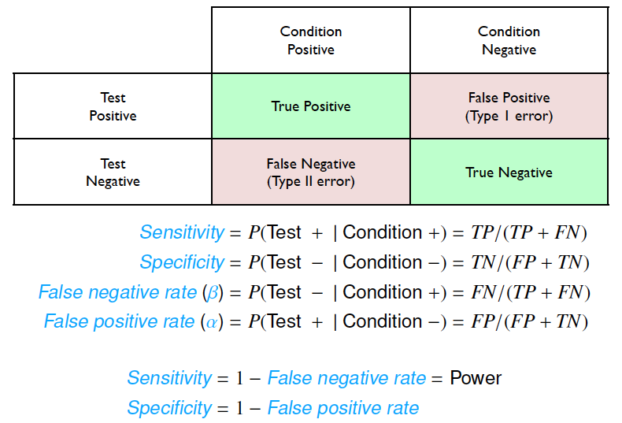
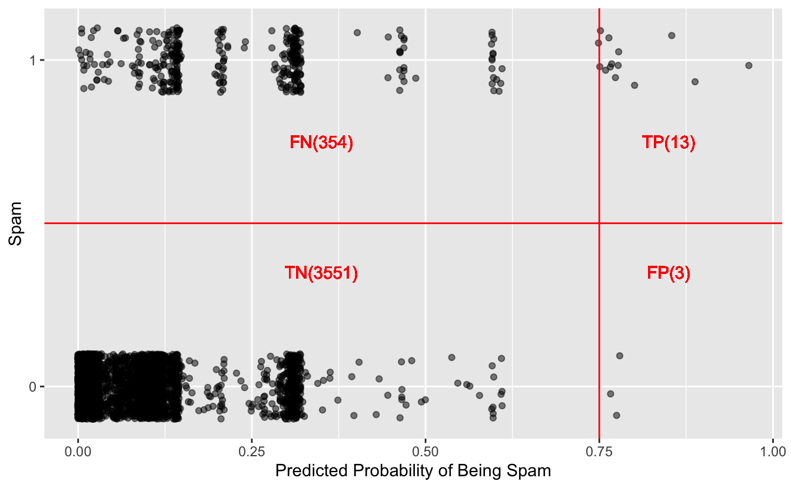
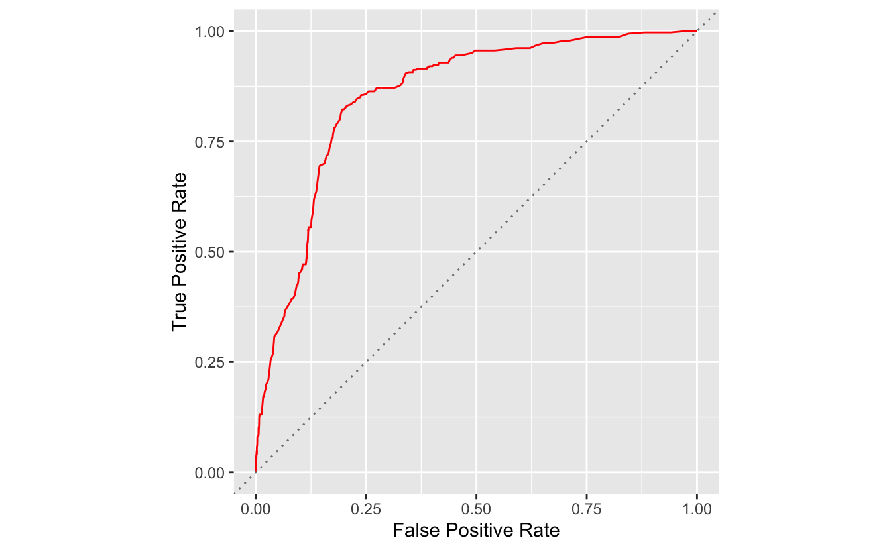
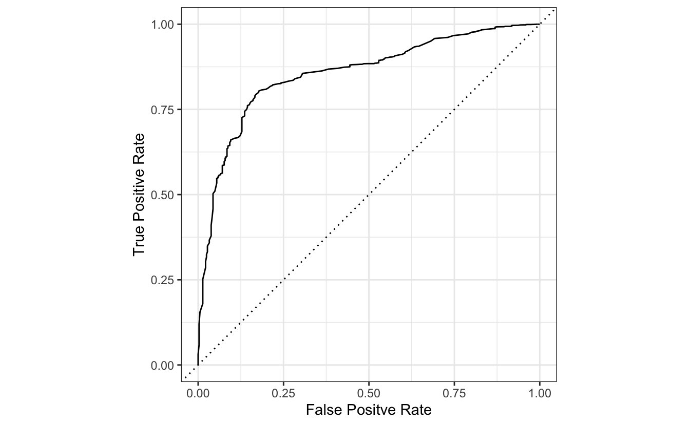

> "A receiver operating characteristic curve, or ROC curve, is a graphical plot that illustrates the diagnostic ability of a binary classifier system as its discrimination threshold is varied. The ROC curve is created by plotting the true positive rate against the false positive rate at various threshold settings." - Wikipedia

Simulation can be very useful for us to understand some concepts in Statistics, as shown in [Probability in R](https://henrywang.nl/probability-in-r/). Here is another example that I used simulation to understand ROC Curve and AUC, the metrics in classification models that I had never fully understand.

Data
----

The simulation in this post was inspired by [OpenIntro Statistics](https://www.amazon.com/OpenIntro-Statistics-Third-David-Diez/dp/194345003X) and the `email` dataset I used can be found in `openintro` package.

<!-- wp:more -->
<!--more-->
<!-- /wp:more -->

<pre class='chroma'><code class='language-r' data-lang='r'><a href='https://rdrr.io/r/base/library.html'>library</a>(<a href='http://tidyverse.tidyverse.org'>tidyverse</a>)

# For the email dataset
<a href='https://rdrr.io/r/base/library.html'>library</a>(<a href='https://github.com/OpenIntroStat/openintro'>openintro</a>)

# For ROC curve plots 
<a href='https://rdrr.io/r/base/library.html'>library</a>(<a href='https://github.com/tidymodels/tidymodels'>tidymodels</a>)</code></pre>

<pre class='chroma'><code class='language-r' data-lang='r'>email
#&gt; # A tibble: 3,921 x 21
#&gt;     spam to_multiple  from    cc sent_email time                image attach
#&gt;    &lt;dbl&gt;       &lt;dbl&gt; &lt;dbl&gt; &lt;int&gt;      &lt;dbl&gt; &lt;dttm&gt;              &lt;dbl&gt;  &lt;dbl&gt;
#&gt;  1     0           0     1     0          0 2012-01-01 07:16:41     0      0
#&gt;  2     0           0     1     0          0 2012-01-01 08:03:59     0      0
#&gt;  3     0           0     1     0          0 2012-01-01 17:00:32     0      0
#&gt;  4     0           0     1     0          0 2012-01-01 10:09:49     0      0
#&gt;  5     0           0     1     0          0 2012-01-01 11:00:01     0      0
#&gt;  6     0           0     1     0          0 2012-01-01 11:04:46     0      0
#&gt;  7     0           1     1     0          1 2012-01-01 18:55:06     0      0
#&gt;  8     0           1     1     1          1 2012-01-01 19:45:21     1      1
#&gt;  9     0           0     1     0          0 2012-01-01 22:08:59     0      0
#&gt; 10     0           0     1     0          0 2012-01-01 19:12:00     0      0
#&gt; # … with 3,911 more rows, and 13 more variables: dollar &lt;dbl&gt;, winner &lt;fct&gt;,
#&gt; #   inherit &lt;dbl&gt;, viagra &lt;dbl&gt;, password &lt;dbl&gt;, num_char &lt;dbl&gt;,
#&gt; #   line_breaks &lt;int&gt;, format &lt;dbl&gt;, re_subj &lt;dbl&gt;, exclaim_subj &lt;dbl&gt;,
#&gt; #   urgent_subj &lt;dbl&gt;, exclaim_mess &lt;dbl&gt;, number &lt;fct&gt;</code></pre>

These data represent incoming emails for the first three months of 2012 for an email account. The variables are explained clearly [here](http://openintrostat.github.io/openintro/reference/email.html).

Logistic Regression Model
-------------------------

Basically the research question is to develop a valid `logistic regression` to predict if an email is `spam`. This post focuses on the ROC curve simulation so we will just jump to the final refined model as shown below.

<pre class='chroma'><code class='language-r' data-lang='r'># data preparation
df &lt;- email %&gt;% 
  mutate(across(<a href='https://rdrr.io/r/base/c.html'>c</a>(to_multiple, cc, image, attach, password, re_subj, urgent_subj), ~if_else(.x &gt; 0, "yes", "no"))) %&gt;% 
  mutate(format = if_else(format == 0, "Plain", "Formated"))

# fit logistic regression model
g_refined &lt;- <a href='https://rdrr.io/r/stats/glm.html'>glm</a>(spam ~ to_multiple + cc + image + attach + winner
                       + password + line_breaks + format + re_subj
                       + urgent_subj + exclaim_mess, data=df, family=binomial)

<a href='https://rdrr.io/r/base/summary.html'>summary</a>(g_refined)
#&gt; 
#&gt; Call:
#&gt; glm(formula = spam ~ to_multiple + cc + image + attach + winner + 
#&gt;     password + line_breaks + format + re_subj + urgent_subj + 
#&gt;     exclaim_mess, family = binomial, data = df)
#&gt; 
#&gt; Deviance Residuals: 
#&gt;     Min       1Q   Median       3Q      Max  
#&gt; -1.7389  -0.4640  -0.2162  -0.1008   3.7746  
#&gt; 
#&gt; Coefficients:
#&gt;                  Estimate Std. Error z value Pr(&gt;|z|)    
#&gt; (Intercept)    -1.7594438  0.1177345 -14.944  &lt; 2e-16 ***
#&gt; to_multipleyes -2.7367955  0.3155876  -8.672  &lt; 2e-16 ***
#&gt; ccyes          -0.5358071  0.3142521  -1.705 0.088190 .  
#&gt; imageyes       -1.8584670  0.7701428  -2.413 0.015815 *  
#&gt; attachyes       1.2002443  0.2391097   5.020 5.18e-07 ***
#&gt; winneryes       2.0432610  0.3527599   5.792 6.95e-09 ***
#&gt; passwordyes    -1.5618002  0.5353765  -2.917 0.003532 ** 
#&gt; line_breaks    -0.0030972  0.0004894  -6.328 2.48e-10 ***
#&gt; formatPlain     1.0130019  0.1379651   7.342 2.10e-13 ***
#&gt; re_subjyes     -2.9934921  0.3777998  -7.923 2.31e-15 ***
#&gt; urgent_subjyes  3.8829719  1.0054222   3.862 0.000112 ***
#&gt; exclaim_mess    0.0092727  0.0016248   5.707 1.15e-08 ***
#&gt; ---
#&gt; Signif. codes:  0 '***' 0.001 '**' 0.01 '*' 0.05 '.' 0.1 ' ' 1
#&gt; 
#&gt; (Dispersion parameter for binomial family taken to be 1)
#&gt; 
#&gt;     Null deviance: 2437.2  on 3920  degrees of freedom
#&gt; Residual deviance: 1861.3  on 3909  degrees of freedom
#&gt; AIC: 1885.3
#&gt; 
#&gt; Number of Fisher Scoring iterations: 7</code></pre>

The logistic regression model `g_refined` is developed and then we can fit it to our data (in practice you may want to fit it to your testing data instead of training data).

<pre class='chroma'><code class='language-r' data-lang='r'>pred &lt;- df %&gt;% 
  select(spam_true = spam) %&gt;% 
  bind_cols(spam_prob = <a href='https://rdrr.io/r/base/Round.html'>round</a>(<a href='https://rdrr.io/r/stats/predict.html'>predict</a>(g_refined, newdata = df, type = "response"), digits = 3))

pred
#&gt; # A tibble: 3,921 x 2
#&gt;    spam_true spam_prob
#&gt;        &lt;dbl&gt;     &lt;dbl&gt;
#&gt;  1         0     0.084
#&gt;  2         0     0.085
#&gt;  3         0     0.091
#&gt;  4         0     0.109
#&gt;  5         0     0.084
#&gt;  6         0     0.085
#&gt;  7         0     0.006
#&gt;  8         0     0.002
#&gt;  9         0     0.279
#&gt; 10         0     0.122
#&gt; # … with 3,911 more rows</code></pre>

As shown above, `spam_true` is the truth which shows if an email is a spam whereas `spam_prob` is the predicted probability that an email is a spam. Take the first email for example. Our `g_refined` predicted that there is only 8.4% chance that this email is a spam, which seems quite accurate.

Probability Threshold
---------------------

The problem remains that what the probability threshold should be for the model to make the final prediction that an email is a spam or not. First, let's try an example of threshold of 0.75, which means that the model thinks an email is a spam if the predicted probability `spam_prob` higher than or equal to 0.75, otherwise not a spam, as shown below.

<pre class='chroma'><code class='language-r' data-lang='r'>pred_cutoff &lt;- pred %&gt;% 
  mutate(cutoff = 0.75,
         spam_pred = <a href='https://rdrr.io/r/base/ifelse.html'>ifelse</a>(spam_prob &gt;= cutoff, 1, 0))

pred_cutoff
#&gt; # A tibble: 3,921 x 4
#&gt;    spam_true spam_prob cutoff spam_pred
#&gt;        &lt;dbl&gt;     &lt;dbl&gt;  &lt;dbl&gt;     &lt;dbl&gt;
#&gt;  1         0     0.084   0.75         0
#&gt;  2         0     0.085   0.75         0
#&gt;  3         0     0.091   0.75         0
#&gt;  4         0     0.109   0.75         0
#&gt;  5         0     0.084   0.75         0
#&gt;  6         0     0.085   0.75         0
#&gt;  7         0     0.006   0.75         0
#&gt;  8         0     0.002   0.75         0
#&gt;  9         0     0.279   0.75         0
#&gt; 10         0     0.122   0.75         0
#&gt; # … with 3,911 more rows</code></pre>

As the predicted probability of the first email is 0.084, which is less than 0.75, this email is not identified as a spam (`spam_pred` = 0).

Next, the metrics of this model can be computed as follows.

<pre class='chroma'><code class='language-r' data-lang='r'>pred_cutoff %&gt;% 
  summarize(cutoff = 0.75, 
          TP = <a href='https://rdrr.io/r/base/sum.html'>sum</a>(spam_true == 1 &amp; spam_pred == 1),
          FP = <a href='https://rdrr.io/r/base/sum.html'>sum</a>(spam_true == 0 &amp; spam_pred == 1),
          TN = <a href='https://rdrr.io/r/base/sum.html'>sum</a>(spam_true == 0 &amp; spam_pred == 0),
          FN = <a href='https://rdrr.io/r/base/sum.html'>sum</a>(spam_true == 1 &amp; spam_pred == 0),
          sensitivity = TP / (TP + FN), 
          specificity = TN / (FP + TN))
#&gt; # A tibble: 1 x 7
#&gt;   cutoff    TP    FP    TN    FN sensitivity specificity
#&gt;    &lt;dbl&gt; &lt;int&gt; &lt;int&gt; &lt;int&gt; &lt;int&gt;       &lt;dbl&gt;       &lt;dbl&gt;
#&gt; 1   0.75    13     3  3551   354      0.0354       0.999</code></pre>

Overall, these metrics of classification models are illustrated below.

Classification Metrics from OpenIntro Statistics

Here is a nice way to illustrate these metrics graphically.

<pre class='chroma'><code class='language-r' data-lang='r'>ggplot(pred, aes(spam_prob, spam_true)) +
  geom_jitter(height = 0.1, alpha = 0.5) +
  geom_vline(xintercept = 0.75, color = "red") +
  geom_hline(yintercept = 0.5, color = "red") +
  scale_y_continuous(breaks = <a href='https://rdrr.io/r/base/c.html'>c</a>(0, 1)) +
  geom_text(label = "FN(354)", x = 0.35, y = 0.75, color = "red") +
  geom_text(label = "TP(13)", x = 0.85, y = 0.75, color = "red") +
  geom_text(label = "TN(3551)", x = 0.35, y = 0.35, color = "red") +
  geom_text(label = "FP(3)", x = 0.85, y = 0.35, color = "red") +
  labs(x = "Predicted Probability of Being Spam",
       y = "Spam")
</code></pre>

ROC Simulation
--------------

Now, after examining these metrics with the probability threshold of 0.75, we can move forward with simulation of all possible probability thresholds.

<pre class='chroma'><code class='language-r' data-lang='r'>metrics_fun &lt;- function(cutoff) {
  pred %&gt;% 
    mutate(spam_pred = <a href='https://rdrr.io/r/base/ifelse.html'>ifelse</a>(spam_prob &gt;= cutoff, 1, 0)) %&gt;% 
    summarize(cutoff = cutoff, 
          TP = <a href='https://rdrr.io/r/base/sum.html'>sum</a>(spam_true == 1 &amp; spam_pred == 1),
          FP = <a href='https://rdrr.io/r/base/sum.html'>sum</a>(spam_true == 0 &amp; spam_pred == 1),
          TN = <a href='https://rdrr.io/r/base/sum.html'>sum</a>(spam_true == 0 &amp; spam_pred == 0),
          FN = <a href='https://rdrr.io/r/base/sum.html'>sum</a>(spam_true == 1 &amp; spam_pred == 0),
          sensitivity = TP / (TP + FN), 
          specificity = TN / (FP + TN))
}</code></pre>

We simulate around 1000 possible values of probability thresholds and compute `sensitivity` and `specificity` metrics accordingly.

<pre class='chroma'><code class='language-r' data-lang='r'>cutoff &lt;- <a href='https://rdrr.io/r/base/seq.html'>seq</a>(0, 1, 0.001)

metrics &lt;- cutoff %&gt;% 
  map(metrics_fun) %&gt;% 
  bind_rows()

metrics
#&gt; # A tibble: 1,001 x 7
#&gt;    cutoff    TP    FP    TN    FN sensitivity specificity
#&gt;     &lt;dbl&gt; &lt;int&gt; &lt;int&gt; &lt;int&gt; &lt;int&gt;       &lt;dbl&gt;       &lt;dbl&gt;
#&gt;  1  0       367  3554     0     0       1          0     
#&gt;  2  0.001   367  3444   110     0       1          0.0310
#&gt;  3  0.002   366  3344   210     1       0.997      0.0591
#&gt;  4  0.003   366  3232   322     1       0.997      0.0906
#&gt;  5  0.004   366  3131   423     1       0.997      0.119 
#&gt;  6  0.005   365  3001   553     2       0.995      0.156 
#&gt;  7  0.006   362  2915   639     5       0.986      0.180 
#&gt;  8  0.007   362  2791   763     5       0.986      0.215 
#&gt;  9  0.008   362  2660   894     5       0.986      0.252 
#&gt; 10  0.009   359  2520  1034     8       0.978      0.291 
#&gt; # … with 991 more rows</code></pre>

With the metrics value in place, we can plot `sensitivity`, true positive rate, against `1 - specificity`, false positive rate.

<pre class='chroma'><code class='language-r' data-lang='r'>ggplot(metrics, aes(x = 1 - specificity, y = sensitivity)) +
  geom_line(color = "red") +
  geom_abline(linetype = "dotted", color = "grey50") +
  labs(x = "False Positive Rate", y = "True Positive Rate") +
  coord_equal()
</code></pre>

This plot is called ROC curve, which shows the trade off between `sensitivity` and `specificity` for all possible probability thresholds. ROC curve is a straightforward way to compare classification model performance. More specifically, the area under the curve (AUC) can be used to assess the model performance.

Tidymodels Approach
-------------------

While simulation is a good way to understand the concepts of classification metrics, it is not convenient to plot ROC curve. In essence, R has some packages to do this automatically. For example, [Tidymodels](https://www.tidymodels.org/) provides some tools such as `roc_curve()` and `roc_auc()` to plot ROC curve and calculate AUC.

<pre class='chroma'><code class='language-r' data-lang='r'># plot ROC Curve in tidymodels
pred %&gt;% 
  roc_curve(truth = <a href='https://rdrr.io/r/base/factor.html'>factor</a>(spam_true), spam_prob) %&gt;% 
  autoplot() +
  labs(x = "False Positve Rate", y = "True Positive Rate")
</code></pre>

<pre class='chroma'><code class='language-r' data-lang='r'>pred %&gt;% 
  roc_auc(truth = <a href='https://rdrr.io/r/base/factor.html'>factor</a>(spam_true), spam_prob)
#&gt; # A tibble: 1 x 3
#&gt;   .metric .estimator .estimate
#&gt;   &lt;chr&gt;   &lt;chr&gt;          &lt;dbl&gt;
#&gt; 1 roc_auc binary         0.855</code></pre>

