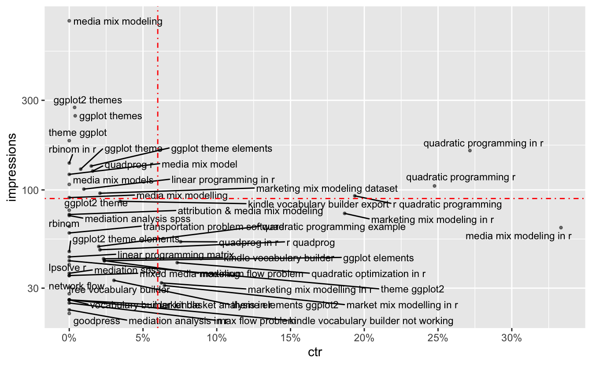

I have been exploring a couple of marketing platforms in my new job as a Marketing Analyst. One of the daily jobs which I like most is to use R to dig into data across different marketing channels to come up with new ideas and recommendations for our marketing activities.

Google Search Console
---------------------

Google Search Console is one of the platforms I have been playing with recently. As you may already know, Google Search Console is a useful website tool for marketers to check website overall performance (e.g., search engine crawl and index issues, google search performance). For example, here is the performance report for my personal blog:

<!-- wp:more -->
<!--more-->
<!-- /wp:more -->

Google Search Performance report for my blog

As you can see from the report, my blog has an average position of 28.4 on the search results, with a gradual increase in terms of impressions and clicks in the past 3 months.

Besides the overall performance report, Google Search Console also provides detailed information for different dimensions, such as `query`, `page` and `country` etc.

searchConsoleR Package
----------------------

[searchConsoleR](https://github.com/MarkEdmondson1234/searchConsoleR) is the r package I'm using to work with Google Search Console data. It is developed by [Mark Edmondson](http://code.markedmondson.me/), who also developed a bunch of other Google related r packages such as [googleAnalyticsR](https://code.markedmondson.me/googleAnalyticsR/). Highly recommend to check out his work if you want to do marketing analytics with R.

Pull Data from Google Search Console
------------------------------------

I mainly use search\_analytics() function in `searchConsoleR` to access my Google Search Console.

Firt load the packages:

<pre class='chroma'><code class='language-r' data-lang='r'><a href='https://rdrr.io/r/base/library.html'>library</a>(<a href='http://code.markedmondson.me/searchConsoleR'>searchConsoleR</a>)
<a href='https://rdrr.io/r/base/library.html'>library</a>(<a href='http://tidyverse.tidyverse.org'>tidyverse</a>)
<a href='https://rdrr.io/r/base/library.html'>library</a>(<a href='http://github.com/slowkow/ggrepel'>ggrepel</a>)</code></pre>

Get the `query` data in the last 3 months (by default):

<pre class='chroma'><code class='language-r' data-lang='r'># authentication 
<a href='https://rdrr.io/pkg/searchConsoleR/man/scr_auth.html'>scr_auth</a>()

query &lt;- <a href='https://rdrr.io/pkg/searchConsoleR/man/search_analytics.html'>search_analytics</a>(
  siteURL = "https://henrywang.nl/",
  dimensions = "query"
) %&gt;% 
  as_tibble()

query %&gt;% 
  <a href='https://rdrr.io/r/utils/head.html'>head</a>(10)</code></pre>

<pre class='chroma'><code class='language-r' data-lang='r'>#&gt; # A tibble: 10 x 5
#&gt;    query                            clicks impressions    ctr position
#&gt;    &lt;chr&gt;                             &lt;int&gt;       &lt;int&gt;  &lt;dbl&gt;    &lt;dbl&gt;
#&gt;  1 quadratic programming in r           44         162 0.272      2.44
#&gt;  2 quadratic programming r              26         105 0.248      2.50
#&gt;  3 media mix modeling in r              21          63 0.333      3.97
#&gt;  4 r quadratic programming              18          93 0.194      4.08
#&gt;  5 marketing mix modeling in r          14          75 0.187      8.32
#&gt;  6 quadprog in r                         4          53 0.0755     7.74
#&gt;  7 kindle vocabulary builder export      3          87 0.0345     8.34
#&gt;  8 quadratic optimization in r           3          41 0.0732     6.05
#&gt;  9 assignment problem in r               2           3 0.667      2   
#&gt; 10 ggplot theme elements                 2         134 0.0149     5.61</code></pre>

Get the `page` data:

<pre class='chroma'><code class='language-r' data-lang='r'>page &lt;- <a href='https://rdrr.io/pkg/searchConsoleR/man/search_analytics.html'>search_analytics</a>(
  siteURL = "https://henrywang.nl/",
  dimensions = "query"
) %&gt;% 
  as_tibble()

page %&gt;% 
  <a href='https://rdrr.io/r/utils/head.html'>head</a>(10)</code></pre>

<pre class='chroma'><code class='language-r' data-lang='r'>#&gt; # A tibble: 10 x 5
#&gt;    page                                       clicks impressions    ctr position
#&gt;    &lt;chr&gt;                                       &lt;int&gt;       &lt;int&gt;  &lt;dbl&gt;    &lt;dbl&gt;
#&gt;  1 https://henrywang.nl/quadratic-programmin…    223        1718 0.130      10.2
#&gt;  2 https://henrywang.nl/transportation-and-a…    149        1076 0.138      20.5
#&gt;  3 https://henrywang.nl/media-mix-modeling-i…    120        2125 0.0565     38.7
#&gt;  4 https://henrywang.nl/kindle-vocabulary-bu…     30         705 0.0426     21.4
#&gt;  5 https://henrywang.nl/maximum-flow-problem…     22         356 0.0618     39.3
#&gt;  6 https://henrywang.nl/ggplot2-theme-elemen…     21        2093 0.0100     26.5
#&gt;  7 https://henrywang.nl/category/optimizatio…     13         111 0.117      19.4
#&gt;  8 https://henrywang.nl/linear-programming-w…      5         293 0.0171     33.9
#&gt;  9 https://henrywang.nl/mediation-analysis-i…      4         342 0.0117     52.1
#&gt; 10 https://henrywang.nl/                           2          60 0.0333     16.9</code></pre>

Get query data for each page (answer questions like *which keyword is driving traffic to one specific page?*):

<pre class='chroma'><code class='language-r' data-lang='r'>page_query &lt;- <a href='https://rdrr.io/pkg/searchConsoleR/man/search_analytics.html'>search_analytics</a>(
  siteURL = "https://henrywang.nl/",
  dimensions = "query"
) %&gt;% 
  as_tibble() %&gt;% 
  group_by(page) %&gt;% 
  arrange(desc(impressions)) %&gt;% 

page_query %&gt;% 
  <a href='https://rdrr.io/r/utils/head.html'>head</a>(10)</code></pre>

<pre class='chroma'><code class='language-r' data-lang='r'>#&gt; # A tibble: 10 x 6
#&gt; # Groups:   page [5]
#&gt;    page                         query        clicks impressions     ctr position
#&gt;    &lt;chr&gt;                        &lt;chr&gt;         &lt;int&gt;       &lt;int&gt;   &lt;dbl&gt;    &lt;dbl&gt;
#&gt;  1 https://henrywang.nl/media-… media mix m…      0         795 0          47.6 
#&gt;  2 https://henrywang.nl/ggplot… ggplot2 the…      1         275 0.00364    37.9 
#&gt;  3 https://henrywang.nl/ggplot… ggplot them…      1         248 0.00403    40.6 
#&gt;  4 https://henrywang.nl/ggplot… theme ggplot      0         183 0          31.6 
#&gt;  5 https://henrywang.nl/quadra… quadratic p…     44         162 0.272       2.44
#&gt;  6 https://henrywang.nl/probab… rbinom in r       0         139 0          79.1 
#&gt;  7 https://henrywang.nl/probab… rbinom in r       0         138 0          79.1 
#&gt;  8 https://henrywang.nl/ggplot… ggplot them…      2         134 0.0149      5.61
#&gt;  9 https://henrywang.nl/ggplot… ggplot theme      1         129 0.00775    34.9 
#&gt; 10 https://henrywang.nl/quadra… quadprog r        2         126 0.0159      9.81</code></pre>

Query Performance Analysis
--------------------------

Depends on different marketing objectives, these data can be used in different ways. As suggested by Google, one of the use cases is to **identify queries with high impressions but low ctr and then try to improve them**. These keywords are important because, for example, my blog is shown quite often for those queries on the search results but people don't click the link to my blog proportionally.

These keywords can be identified as follows:

<pre class='chroma'><code class='language-r' data-lang='r'>query %&gt;% 
  # remove queries with very few impressions
  <a href='https://rdrr.io/r/stats/filter.html'>filter</a>(impressions &gt; 20) %&gt;% 
  ggplot(aes(ctr, impressions, label = query)) +
  geom_point(alpha = .5, size = .8) +
  <a href='https://rdrr.io/pkg/ggrepel/man/geom_text_repel.html'>geom_text_repel</a>(size = 3) +
  # average impression is around 90
  geom_hline(yintercept = 90, color = "red", linetype = "dotdash") +
  # average ctr is 6%
  geom_vline(xintercept = .06, color = "red", linetype = "dotdash") +
  scale_y_log10() +
  scale_x_continuous(labels = scales::<a href='https://scales.r-lib.org//reference/label_percent.html'>label_percent</a>(accuracy = 1),
                     breaks = <a href='https://rdrr.io/r/base/seq.html'>seq</a>(0, .3, .05))
</code></pre>

Queries with High Impressions but Low CTR

As you can see from the graph, the top-left grid of the plot shows the queries with high impressions but low ctr, among which are a few keywords (e.g., `ggplot2 themes`) linked to [ggplot2 Theme Elements Demonstration](https://henrywang.nl/ggplot2-theme-elements-demonstration/).

Page Title and Snippet to My Blog on SERP

What I can do next is to improve the page title and meta description to make it more relevant on the search results so that the CTR could be increased, resulting in more traffic to my blog. *I didn't do this for my blog as I don't want to go that far in that direction but it is highly recommended to implement it for your company website.*

This is an example of what we can do with R to conduct marketing analyses. I hope I can share with you more and will keep writing blogs about marketing analysis with R in the next coming weeks!

