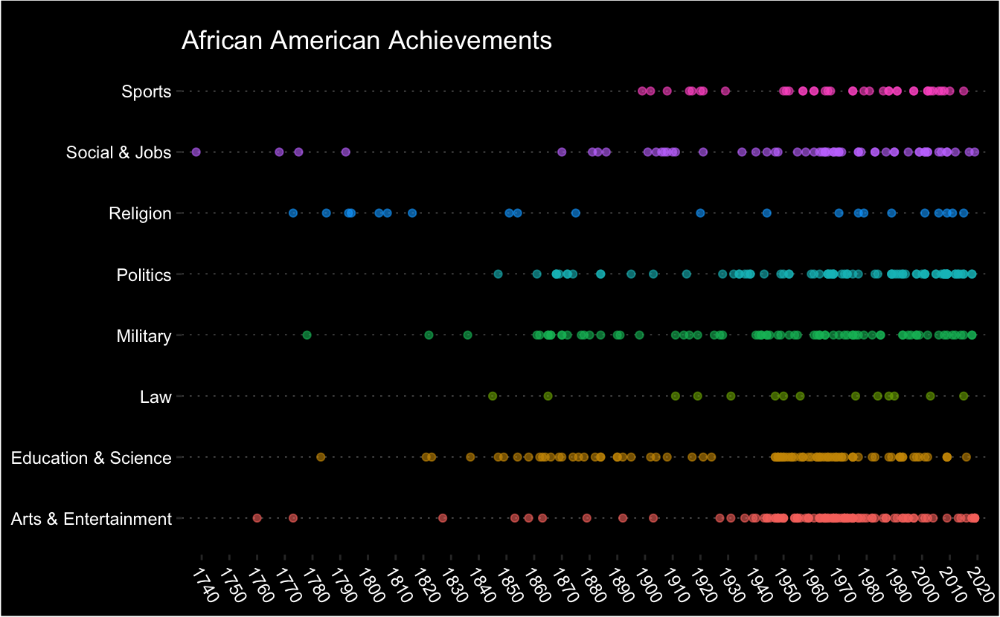

I have been writing a few posts about R on my blog and are getting annoyed with the workflow back and forth between RStudio and WordPress. Overall, the previous workflow has two main pitfalls making me frustrated:

-   **R Code**

Coping R code from RStudio and pasting it to WordPress can take me much time. Code highlight is also challenging, although eventually I figured out that the plugin of [SyntaxHighlighter Evolved](https://wordpress.org/plugins/syntaxhighlighter/) did a great job.

-   **R Output**

Often I need to export R outputs (e.g., ggplot2 plots) and upload to WordPress, sometimes formatting them a bit.

<pre class='chroma'><code class='language-r' data-lang='r'><a href='https://rdrr.io/r/base/library.html'>library</a>(<a href='http://tidyverse.tidyverse.org'>tidyverse</a>)

firsts &lt;- read_csv('https://raw.githubusercontent.com/rfordatascience/tidytuesday/master/data/2020/2020-06-09/firsts.csv')
firsts
#&gt; # A tibble: 479 x 5
#&gt;     year accomplishment              person                gender     category  
#&gt;    &lt;dbl&gt; &lt;chr&gt;                       &lt;chr&gt;                 &lt;chr&gt;      &lt;chr&gt;     
#&gt;  1  1738 First free African-America… Gracia Real de Santa… African-A… Social &amp; …
#&gt;  2  1760 First known African-Americ… Jupiter Hammon (poem… Female Af… Arts &amp; En…
#&gt;  3  1768 First known African-Americ… Wentworth Cheswell, … African-A… Social &amp; …
#&gt;  4  1773 First known African-Americ… Phillis Wheatley (Po… Female Af… Arts &amp; En…
#&gt;  5  1773 First separate African-Ame… Silver Bluff Baptist… African-A… Religion  
#&gt;  6  1775 First African-American to … Prince Hall           African-A… Social &amp; …
#&gt;  7  1778 First African-American U.S… the 1st Rhode Island… African-A… Military  
#&gt;  8  1783 First African-American to … James Derham, who di… African-A… Education…
#&gt;  9  1785 First African-American ord… Rev. Lemuel Haynes. … African-A… Religion  
#&gt; 10  1792 First major African-Americ… 3,000 Black Loyalist… African-A… Social &amp; …
#&gt; # … with 469 more rows</code></pre>

<pre class='chroma'><code class='language-r' data-lang='r'>ggplot(firsts, aes(year, category, color = category)) +
  geom_point(alpha = 0.6) +
  scale_x_continuous(breaks = <a href='https://rdrr.io/r/base/seq.html'>seq</a>(1730, 2020, 10),
                     expand = <a href='https://rdrr.io/r/base/c.html'>c</a>(0.015, 0.975)) +
  labs(x = NULL,
       y = NULL,
       title = "African American Achievements") +
  theme(legend.position = "none",
        plot.background = element_rect(fill = "black"),
        plot.title = element_text(color = "white",
                                      margin = margin(t = 10)),
        panel.background = element_rect(fill = "black"),
        panel.grid.major.x = element_blank(),
        panel.grid.major.y = element_line(color = "white", size = 0.1, linetype = "dotted"),
        panel.grid.minor = element_blank(),
        axis.text = element_text(color = "white"),
        axis.text.x = element_text(angle = -60, vjust = 1, hjust = 0),
        axis.title = element_text(color = "white"))
</code></pre>

